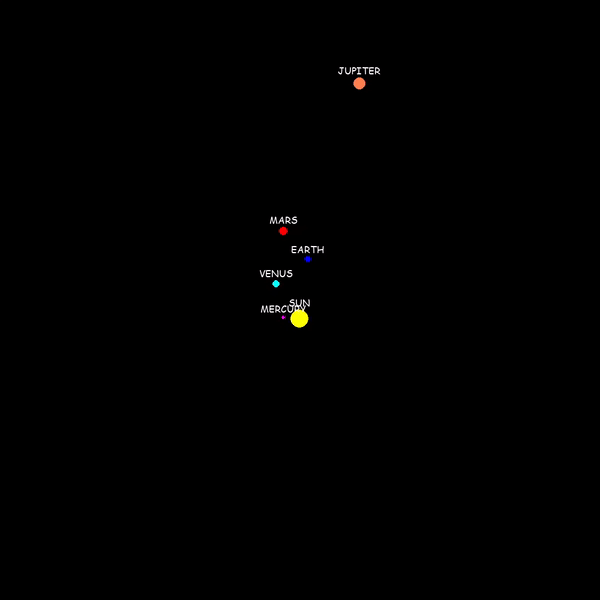

# Planet System Simulator

This project maps the behavior of planets in systems using Isaac Newton's Law of Universal Gravitation, given by the formula:

The simulation results are displayed on the screen thanks to the PyGame package.

## Example of Simulation

